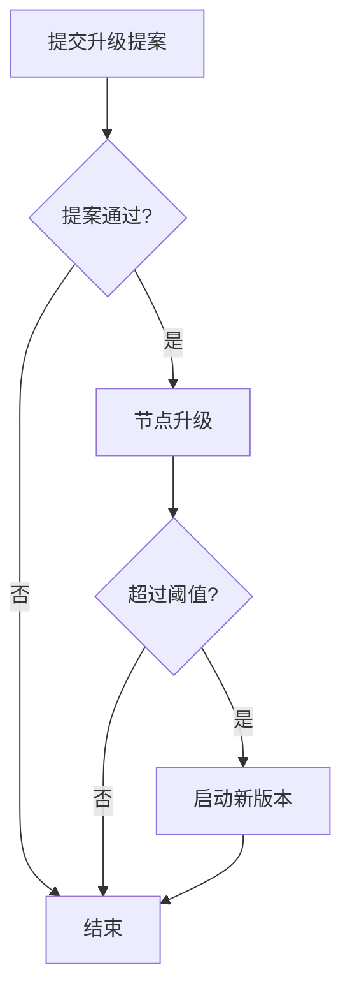

## 软件升级流程：


## 提交升级提案
提案内容以json的方式存储在文件software_upgrade_proposal中
``` text
{
    "title":"testnet-v1.1.0 upgrade",
    "description":"upgrade for smart contract",
    "type":"SoftwareUpgrade",
    "deposit":{
        "denom":"pnch",
        "amount":"10000000000000"
    },
    "version":1,
    "software":"https://github.com/netcloth/netcloth-chain/releases/tag/testnet-v1.1.0",
    "switch_height":160,
    "threshold":"0.8"
}
```

### 字段详情
- title 标题
- description 升级的描述
- type 软件升级使用SoftwareUpgrade
- deposit 为本次提案抵押的token
- version 本次升级的版本号，软件切换的时候根据版本号来切换，重要
- software 本次升级的程序下载地址，比如github的release链接
- switch_height 升级的指定高度，在指定高度统计验证人节点生升级比例，如果超过阈值则执行版本切换
- threshold 升级阈值，指已经升级的验证人voting power占整个voting power的比例，超过这个值才执行全网的版本升级

### 提交提案
``` sh
nchcli tx gov submit-proposal software-upgrade ~/software_upgrade_proposal --from $(nchcli keys show -a bob) -y
```

### 对提案投票
``` sh
nchcli tx gov vote 1 yes --from $(nchcli keys show -a bob) -y
```

## 节点升级
### 主动升级
在提案通过后指定高度前升级，到达指定高度自动切换为新版本
``` sh
# 1. 下载新版本nchd1

# 2. 关闭旧软件
kill -f nchd

# 3. 安装新版本 nchd1 并启动（copy to bin）
nchd1 start

# 4. 区块到达指定高度，自动升级

# 5. 查询当前版本是否升级成功
nchcli query upgrade info
```

### 被动升级
如果本次升级提案通过并且在指定高度升级到新版本的voting power比例超过软件升级的阈值那么本次升级会最终会执行，对于没有在指定高度升级的节点会自动退出程序，需要升级到新版本才能继续运行，升级成功后会继续自动同步到最近区块

``` sh
# 1. 下载新版本nchd1

# 2. 确保关闭旧软件
kill -f nchd

# 3. 安装新版本 nchd1 并启动
nchd1 start

# 4. 查询当前版本是否升级成功
nchcli query upgrade info
```

